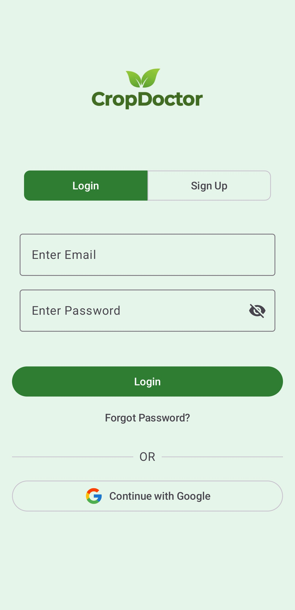
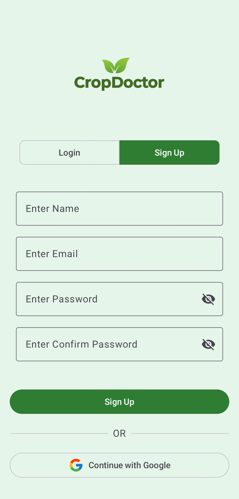
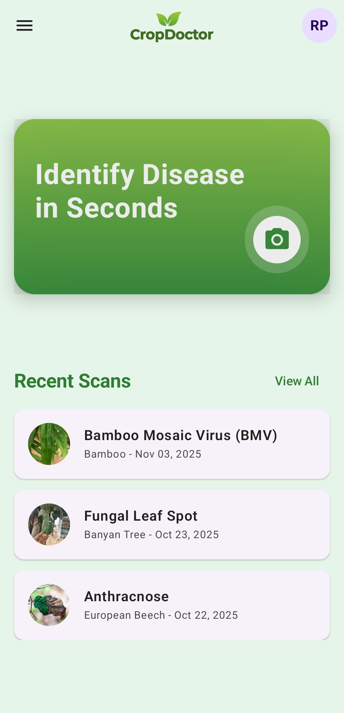
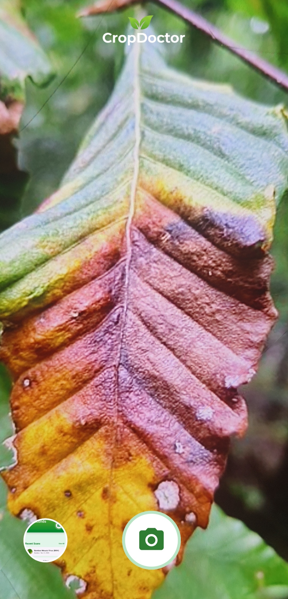
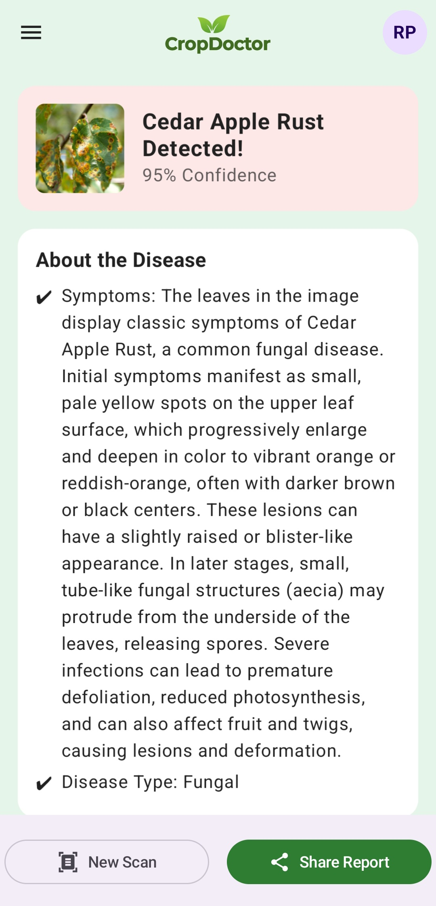
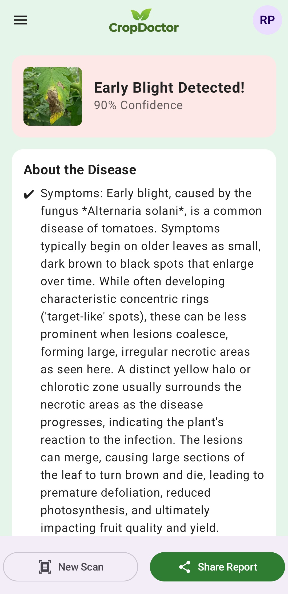
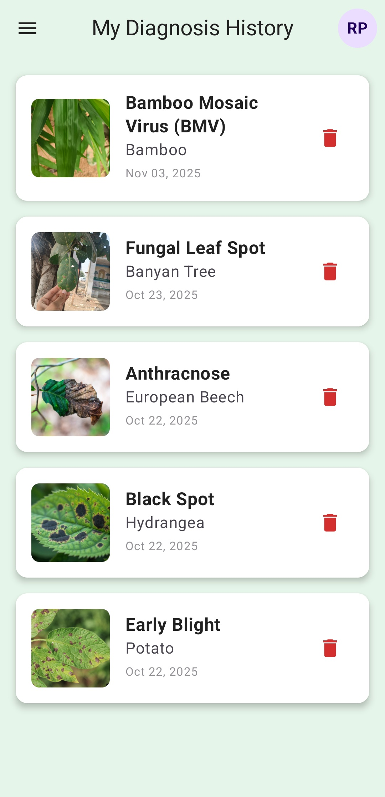
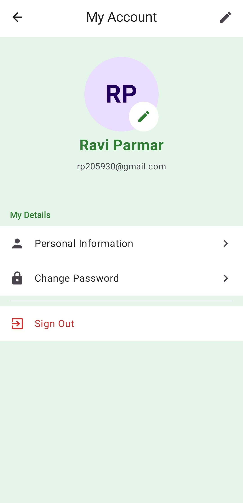
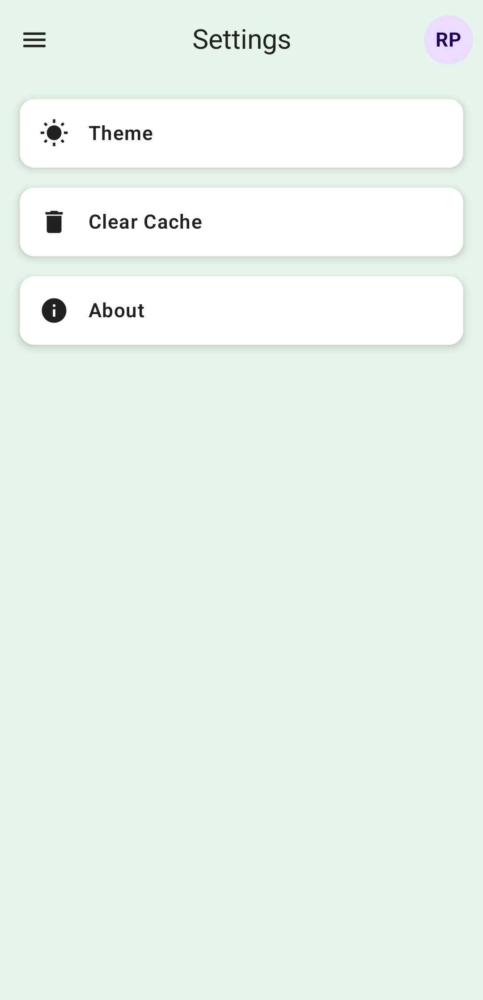
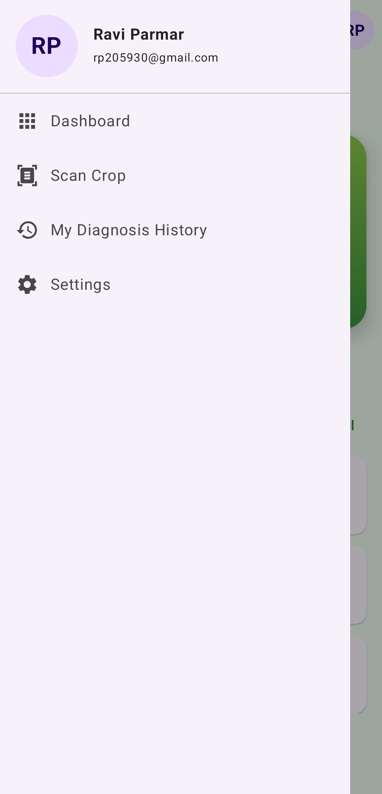

# CropDoctor

CropDoctor is an Android application designed to help farmers and gardeners quickly identify plant diseases using image recognition. By simply taking a picture of a diseased leaf, users can get an instant diagnosis, detailed descriptions of the disease, recommended treatments, and prevention strategies. The app also keeps a history of all diagnoses for easy reference.

## ✨ Features

Here's a quick tour of CropDoctor's key features, presented with detailed descriptions and illustrative screenshots:

| Feature                   | Screenshots                                                                                                       |
| :------------------------ | :---------------------------------------------------------------------------------------------------------------- |
| **User Authentication**   _Securely log in or create a new account using email/password or conveniently with your Google account._ | **Login Screen:**    &nbsp; **Register Screen:**    |
| **Plant Disease Diagnosis**   _Effortlessly identify plant diseases by taking a photo of a diseased leaf. Get instant results and key information._ | **Dashboard:**    &nbsp; **Scan Crop Screen:**    |
| **Detailed Diagnosis Results**   _Receive comprehensive details about the detected disease, including symptoms, type, treatment, and prevention strategies._ | **Result (Cedar Apple Rust):**    &nbsp; **Result (Early Blight):**    |
| **Diagnosis History**   _Access a chronological record of all your past diagnoses, allowing you to review previous scans and their results._     | **History Screen:**           |
| **User Profile Management**   _Manage your personal information and account settings, ensuring your app experience is tailored to you._ | **Profile Screen:**           |
| **Settings**   _Customize various app preferences, such as theme settings, and manage local data like cache._              | **Settings Screen:**         |
| **Navigation Drawer**   _Navigate seamlessly through different sections of the app with an intuitive and accessible side menu._     | **Navigation Drawer Open:**    |

## 🚀 Technology Stack

*   **Jetpack Compose:** For building the declarative UI.
*   **Gemini API:** Utilized for advanced image analysis and accurate disease identification.
*   **Firebase (Firestore, Authentication, Storage):** Provides robust backend services for user management, secure authentication, and data storage.
*   **Coil:** An efficient image loading and caching library for Android.
*   **Navigation Compose:** For seamless in-app navigation management.
